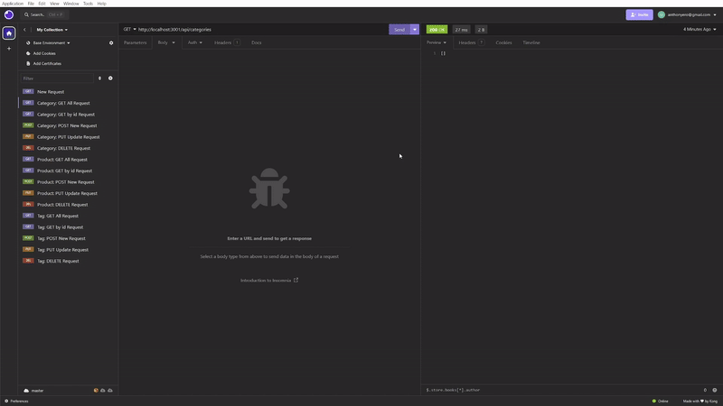

# E-Commerce Service

## Description 

A back end for an e-commerce site. Utilizes a Express.js API and uses Sequelize to interact with a PostgreSQL database.

**Features include**:

- Allows users to build and access a e-commerce database, structured using the schema database file provided. 
- Provides query functionality to access the following tables within the database:
    - Categories
        - **Retrieve all** categories with their associated products 
        - **Retrieve a specific** category, with its products, utilizing the category's id
        - **Add a new** category
        - **Update** a category
        - **Delete** a category
    - Products
        - **Retrieve all** products with their associated category and tag data 
        - **Retrieve a specific** product, with its catregory and tag data, utilizing the product's id
        - **Add a new** product with properties such as:    
            - Product Name
            - Price
            - Stock
            - Category
            - Tags
        - **Update** a product
            - Can update any property that belongs to a product
        - **Delete** a product
    - Tags
        - **Retrieve all** tags with their associated products 
        - **Retrieve a specific** tag, with its products, utilizing the tag's id
        - **Add a new** tag
        - **Update** a tag
        - **Delete** a tag

This exercise was provided by Northwestern University and edX through the Coding boot camp. Submitted as fulfillment of the Module 13 exercise during the December, 2023 - June, 2024 cohort.

## Table of Contents

- [Installation](#installation)
- [Usage](#usage)
- [Links](#links)
- [Credits](#credits)
- [License](#license)

## Installation

- Prerequisites:
    - Download and install [Node.js](https://nodejs.org/en)
    - Download and install [PostgreSQL](https://www.postgresql.org/)

1. Download this repository's contents to your local machine utilizing the green `Code` button. 
    - The "Download ZIP" option is sufficient for installation. Ensure that you extract the folder's contents.
2. Open the downloaded directory in your preferred command-line interface. 
    - Possible options including "Terminal" on Mac, "Git Bash" on Windows, or VSCode.
3. Within the downloaded directory, run the following command: 
    > npm install 
    - This will install the Node.js packages `express`, `sequelize`, `pg`, `dotenv` and their dependencies which are detailed in the `package.json` file.

## Usage

**For first-time users:**

1. Initiate a PostgreSQL shell session and run the `schema.sql` file in the "db" directory. Within the shell session, run the file using the following command: `\i schema.sql;`
	
2. Create a `.env` variable with your PostgreSQL credentials. In particular, your user name and your password for your Postgres session.
    - Please reference the `.env.EXAMPLE` file as a template.

3. Within the downloaded directory, initiate the application by using the following command:
> npm run watch

4. Open a second command terminal, in the same directory, to seed your database using the following command:
    > npm run seed
    - Seed files are provided for demonstration. Feel free to update with your own, relevant data.

5. Utilizing software such as Insomnia or Postman, query and manipulate your database's content using the `GET`, `POST`, `PUT`, and `DELETE` routes defined in the "routes" directory.

6. Shut down the Express server by closing your terminal or using `ctrl + c`

**For returning users:**

1. Consider whether you would like to drop and recreate your tables.
    - If so, you will need to seed your tables again.
    - If you would like to continue working with existing data in tables:
        - Open `server.js` in your preferred text editor and change `sequelize.sync({ force: true })` to `sequelize.sync({ force: false })`. Save your changes.

2. Initiate the application by using the following command:
> npm run watch

3. Utilize Insomnia, Postman, etc. to interact with your e-commerce database.

## Links

- [Link to a walkthrough video](https://drive.google.com/file/d/1I_GySHMYFgF2pimZOxE8zrvV6tt97iTq/view?usp=sharing)

- [Link to the GitHub repository](https://github.com/anthonyero/e-commerce-service)

The relevant JavaScript and SQL files are located within this repository. 

JavaScript files include comments detailing changes implemented within them. Further justifications can also be found within the repository's "Issues" tab.

Please refer to the commit history and branches within the repository for a tracked history of changes.

## Credits

Initial starter code was provided by Northwestern University and edX through the Coding boot camp. Starter files were uploaded in the commit: "Initial commit - starter files".

This application utilzes `Node.js`, `PostgreSQL`, and the `express`, `sequelize`, `pg`, and `dotenv` npm packages.

Software used to test routes in the walkthrough video is [`Insomnia`](https://insomnia.rest/).

## License

N/A

